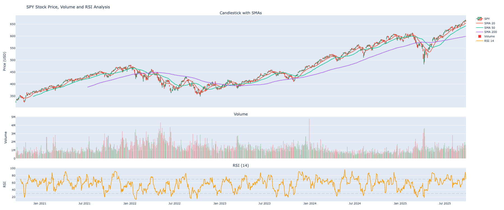
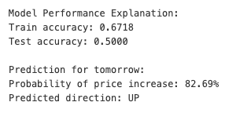

# SPY Stock Price Direction Prediction (LSTM)

Predicts whether the **next trading day’s close** for the S&P 500 ETF (SPY) will be **higher or lower** than today’s close.

## 📈 Project Highlights
- Pulls daily OHLCV data automatically from the **Alpaca API**
- Feature engineering: **SMA (20/50/200), Bollinger Bands, RSI (14)**, and volume-based signals
- Deep learning: **Long Short-Term Memory (LSTM)** sequence model with TensorFlow/Keras
- Evaluation: **train/test accuracy**, classification report, and next-day probability output
- Visualization: Interactive **Plotly dashboard** (candlestick, SMAs, Bollinger Bands, volume, RSI)

## 🛠️ Tech Stack
Python · pandas · numpy · scikit-learn · TensorFlow/Keras · Plotly · Alpaca API

## 🚀 How to Run
1. Clone this repo
2. [Create and generate Alpaca API Keys](<https://app.alpaca.markets/signup>)
3. Add your Alpaca keys to a `config.py` or `.env` (see `config_template.py`)

## 📊 Results

Below are example outputs from the project:

### Candlestick with Indicators

### Model Evaluation Output

